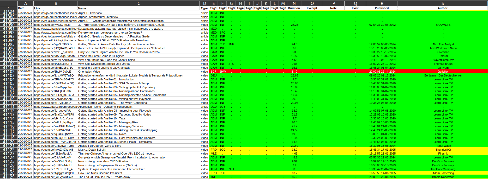

# Read-Watch-Log
## Description
Read-Watch-Log is a tool designed to process specially crafted XLSX/ODS files. It extracts and processes data from spreadsheets and interacts with the YouTube Data API to retrieve video details. The tool supports various operations, including extracting links, ordering tags, converting data to JSON, and detecting duplicates.

## Features
- Supports **XLSX** and **ODS** file formats.
- Extracts and processes data from spreadsheets.
- Provides multiple processing options, including:
    - Extracting YouTube links from a 
      worksheet and processing them.
    - Detecting duplicates
    - Converting data to JSON
    - Ordering tags
    - Fetching routines from a worksheet and 
      organizing them by days and categories.
- Supports chunked processing for large datasets.
- Allows automatic searching for non-processed records.
## Prerequisites
The program performs operations on a file with this structure:


## Installation
1. Clone the repository:
```shell
git clone <repository_url>
cd readwatchlog
```

2. Install the required dependencies:
```shell
pip install -r requirements.txt
```
## Usage
Run the script with the necessary arguments:
```shell
python main.py --file <filename> --sheet <sheetname> [options]
```

### Required Arguments:
- `--file`: Name of the spreadsheet file to process (XLSX/ODS format).
- `--sheet`: Name of the sheet within the spreadsheet.
### Optional Arguments:
- `--start`: Start value for processing.
- `--end`: End value for processing.
- `--output`: Flag to generate an output file.
- `--custom_name`: Custom name for the output file (default: timestamped name).
- `--chunk`: Process only the specified number of records.
- `--auto`: Auto-search for non-processed records.
### Mutually Exclusive Options:
Only one of the following options can be used at a time:
- `--links`: Extract links from the file.
- `--routines`: Extract routines from the file.
- `--tags`: Order tags from the file.
- `--json`: Convert data to JSON format.
- `--duplicates`: Detect duplicate records.
## Classes Overview
### `BaseProcessor`
Abstract class defining methods to interact with XLSX/ODS files, process data, and retrieve YouTube video details.

### `ReadWatchLog`
Determines the file type, selects the corresponding processor, and delegates processing tasks.

### `OdsProcessor`
Handles ODS (OpenDocument Spreadsheet) files and extracts/processes data.

### `XlsxProcessor`
Handles XLSX (Excel) files and extracts/processes data.

## Example Usage
```shell
python main.py --file Vault.xlsx --sheet Vault --links
```

This will process the `Vault.xlsx` file and extract links from the `Vault` sheet.

## License
This project is licensed under the [**Creative Commons Attribution-NonCommercial 4.0 (CC BY-NC 4.0)**](https://creativecommons.org/licenses/by-nc/4.0/legalcode.en) license.

### Summary:
- You are **free to use, modify, and share** this software **for non-commercial purposes**.
- **Commercial use is strictly prohibited**.
- No warranties or liability: The author is **not responsible** for any issues arising from use.

## Authors
Maintained by [**Elenche Zetetique**](https://elenche-zetetique.com/). Temporary unavailable.